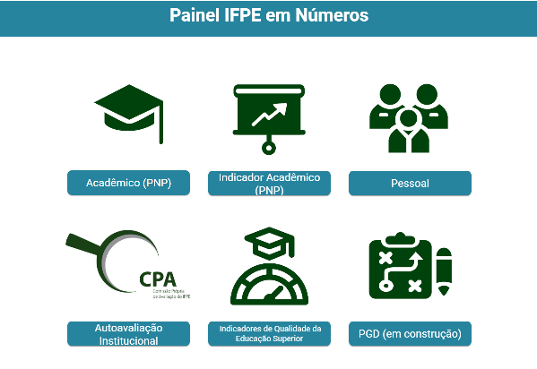

```{r setup, include=FALSE, echo=TRUE}
```


<style>
.info-tile {
border: 1px solid #ccc;
padding: 15px;
margin-bottom: 10px;
background-color: #f9f9f9;
border-radius: 5px;
flex: 1; /* Para que as caixas ocupem espaço igual */
}
.info-tiles-container {
display: flex;
gap: 10px;
margin-bottom: 20px;
}
</style>
<div class="info-tiles-container">
<div class="info-tile">
<h3>IFPE em Números</h3>
[visite nosso BI](https://lookerstudio.google.com/u/0/reporting/1698017d-c2cc-4f11-b0c4-b6b70fdc4cd2/page/u7UuD)
```{r echo=FALSE}
    
```

<p>Informação importante aqui.</p>

</div>
<div class="info-tile">
<h3>Destaque 2</h3>
<p>Outro dado relevante.</p>

</div>
<div class="info-tile">
<h3>Destaque 3</h3>
<p>Mais detalhes do conteúdo.</p>

</div>
</div>